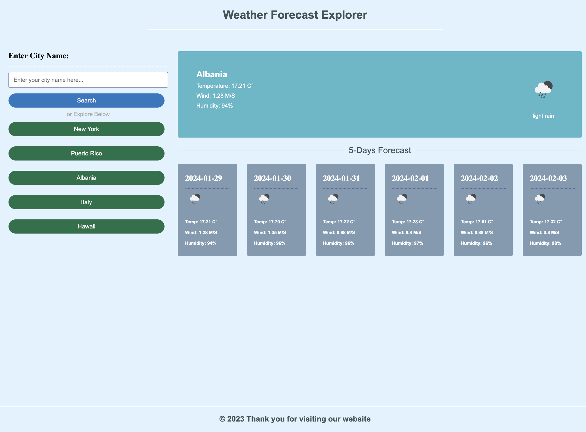

# Weather Forecast Explorer

## Overview:

The Weather Forecast Explorer is a user-friendly web application for checking real-time weather and 5-day forecasts effortlessly.

## Features:

- **Current Weather:**

  - Displays temperature, wind speed, and humidity for the entered city.

- **5-Day Forecast:**

  - Provides a quick overview of the upcoming weather conditions.

- **Search Functionality:**

  - Enter any city name to instantly view its weather details.

- **Explore Predefined Cities:**

  - Quickly check the weather for popular cities like New York, Puerto Rico, and more.

- **Responsive Design:**
  
  - Ensures a seamless experience across various devices.

## How to Use:

1. **Access:**

   - Open the Weather Forecast Explorer in your web browser.

2. **Search:**

   - Enter a city name and click "Search" to see current weather and the 5-day forecast.

3. **Explore Cities:**

   - Use predefined buttons to check weather for popular cities.

4. **View Information:**

   - Check temperature, wind, and humidity details in an organized layout.

5. **Responsive Design:**

   - Enjoy a consistent experience on desktops, tablets, and smartphones.

6. **Error Handling:**
   
   - Receive alerts for any issues, ensuring a smooth user experience.

---

### Stay informed about the weather with the simple and effective [Weather Forecast Explorer](https://jetniksyla.github.io/Weather_Forecast_API/).

## Project Screenshot:

\](assets/Weather_API.html.png)](assets/Weather_API.png)
